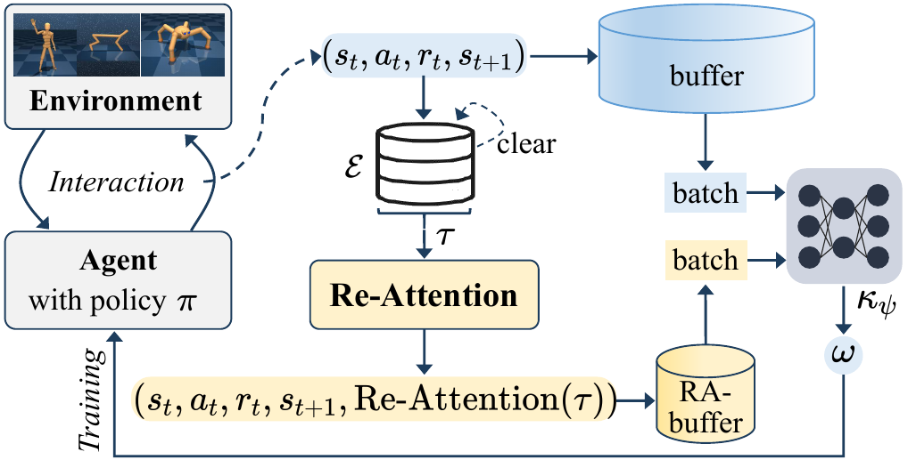
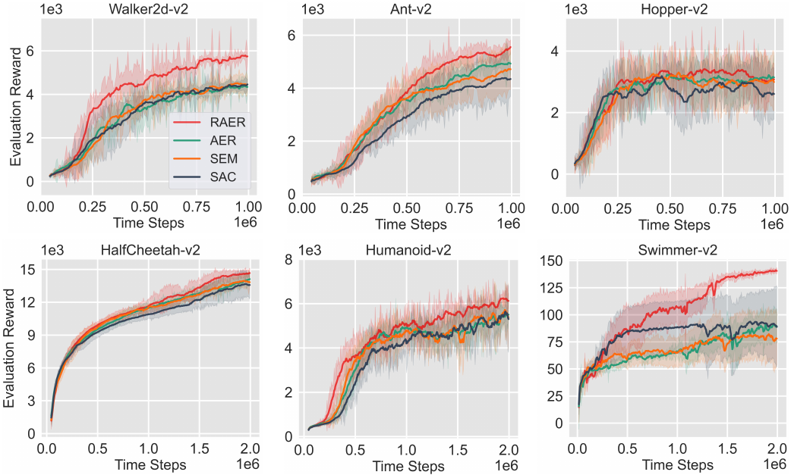
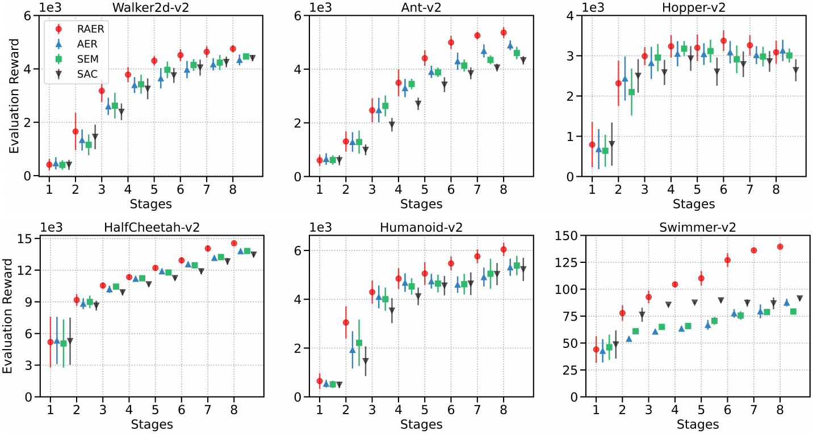
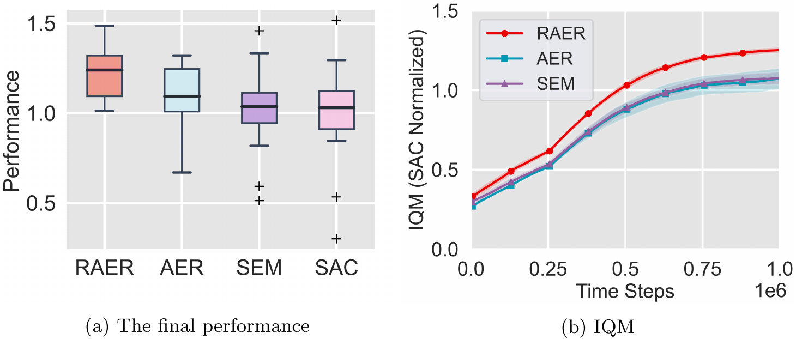
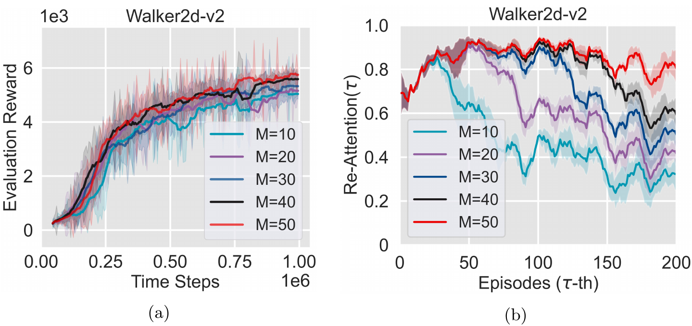
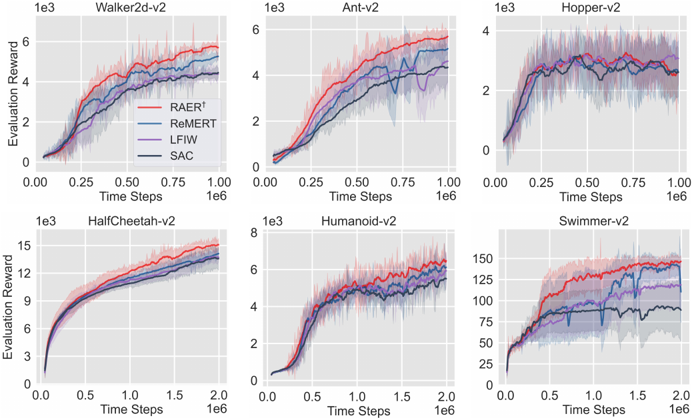
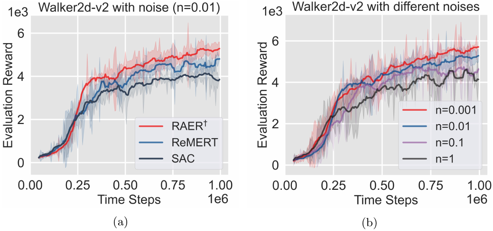

<h1 align = "center">Re-attentive Experience Replay</h1>

    <a href="https://scholar.google.com/" style="font-size: 23px">Wei Wei</a> &emsp;
    <a href="https://github.com/DkING-lv6" style="font-size: 23px">Da Wang</a> &emsp;
    <a href="https://scholar.google.com/" style="font-size: 23px">Lin Li</a> &emsp;
    <a href="https://scholar.google.com/citations?user=iGc61hUAAAAJ&hl=da" style="font-size: 23px">Jiye Liang</a> &emsp;

<h1 align = " center">Abstract</h1> 

Experience replay, which stores past samples for reuse, has become a fundamental component of off-policy reinforcement learning. Some pioneering works have indicated that prioritization or reweighting of samples with on-policiness can yield significant performance improvements. However, this type of method neglect sample diversity, which may result in instability or even long-term performance slumps. In this work, we introduce a novel Re-attention criterion to reevaluate recent experiences, thus benefiting the agent from learning about them. We call this overall algorithm, Re-attentive Experience Replay (RAER). RAER employs a parameter-insensitive dynamic testing technique to enhance the attention of samples generated by policies with promising trends in overall performance. By wisely leveraging diverse samples, RAER fulfills the positive effects of on-policiness while avoiding its potential negative influences. Extensive experiments demonstrate the effectiveness of RAER in improving both performance and stability. Moreover, replacing the on-policiness component of the state-of-the-art approach with RAER can yield significant benefits.

<h1 align = "center">Motivation</h1>

In deep reinforcement learning, the on-policiness prioritization criterion (i.e., using samples from the on-policy distribution) is widely used in advanced experience replay methods. Existing works typically approximate the on-policy distribution by using samples from the most recent episodes. Nevertheless, relying solely on recent samples (i.e., prioritizing on-policiness) is not a panacea and may lead to instability and long-term performance slumps in some cases. On the one hand, as the exploration rate decreases, the policy fits in a narrow region of the state space. The experience replay methods with on-policiness criterion use a small high-priority subset of the buffer and continuously replenish similar samples. As a result, the agent gradually forgets what it has already learned as the sampling frequency of past experiences decreases. It may result in model collapse and catastrophic forgetting, leading to unstable learning dynamics. On the other hand, consistently good performance in recursive learning systems like RL is crucial. The system will continue to offer valuable training data as long as it keeps improving. However, the generated samples are insufficient to let the agent recover if performance decreases due to errors in function approximation, poor exploration, etc. Focusing on recent samples can lead to long-term performance slumps in this case. These issues may dramatically reduce data efficiency and significantly impact safety-sensitive real-world domains. Here, we note that the correct provision of diverse samples (i.e., past experience) in experience replay is critical to avoiding the aforementioned issues.

In this work, we propose a new experience replay method termed Re-attentive Experience Replay (RAER). The main principle of RAER is to improve the attention of samples generated by policies with promising trends in overall performance by reevaluating recent experiences.

<h1 align = "center">Contribution</h1>

1. We propose Re-attention, a novel prioritization criterion for experience replay that addresses potential issues of instability and long-term performance slumps in the advanced methods that prioritize on-policiness. By incorporating sample diversity wisely, Re-attention improves the stability and performance of the learning process.

2. We design an easy-to-implement experience replay algorithm termed RAER, which leverages the benefits of on-policiness while circumventing its potential negative impacts.

3. We demonstrate the performance and stability benefits of RAER and highlight its key properties. Importantly, RAER can be used as a plug-in to replace the on-policiness component in state-of-the-art methods, gaining even greater advantages.

<h1 align = "center">Overview</h1>

To summarize, we introduce a Re-attention criterion to reevaluate the recent samples (Sec. 4.2) and then use a likelihood-free density estimation approach to achieve this prioritized replay (Sec. 4.3). These two parts constitute the proposed Re-attentive Experience Replay (RAER) algorithm. The illustration can be found in Fig. 1.

    

<small> Figure 1. Illustration of RAER. The collected samples are stored in a conventional buffer and, after processing, in a newly introduced smaller-size RA-buffer. In the processing phase, RAER caches the samples of the current episode $\tau$ in an episode memory $\mathcal{E}$ (cleared after use), and then updates the samples through the Re-Attention calculation (Sec. 4.2). On this basis, RAER uses a likelihood-free density estimator $\kappa_{\psi}$ to reweight the batch samples uniformly drawn from the conventional buffer, then used for training the agent (Sec. 4.3). </small>

The detailed analysis and implementation can be found in our paper.

<h1 align = "center">Experiments</h1>

In this section, we aim to answer the following questions:

1. Does RAER perform better than the representative on-policiness and diversity methods?

2. Is RAER more stable?

3. Is RAER sensitive to hyperparameters?

4. Can RAER replace the on-policiness components in related methods and benefit them?

5. Is RAER robust to outliers in the reward function?

The code is available on https://github.com/DkING-lv6/RAER.

## Performance of Adaptive Diversity

    

<small> Figure 2. Performance of RAER (ours), AER, and SEM combined with SAC on Mujoco tasks. The shaded region represents the standard deviation of the average evaluation over ten trials with different random seeds. </small>

## Stability Analysis

### Performance Stability

    

<small> Figure 3. The performance stability. </small>

### Statistical Reliability of Results

    

<small> Figure 4. The statistical reliability of results across all runs. </small>

## Sensitivity Analysis

    

<small> Figure 5. (a) Performance of RAER with different M; (b) The Re-Attention(\tau) curves with different M, X-axis indicates \tau-th episode. </small>

## Analysis of Replacing On-policiness

    

<small> Figure 6. Performance of RAER^\dagger (ours), ReMERT, and LFIW combined with SAC on Mujoco tasks. The shaded region represents the standard deviation of the average evaluation over ten trials with different random seeds. </small>

## Robustness to Noisy Rewards

    

<small> Figure 7. (a) Performance of RAER^\dagger, ReMERT and SAC with reward noise; (b) Performance of RAER^\dagger with different noises. </small>

<h1 align = "center">Conclusion</h1>

On-policiness criterion enjoys excellent popularity in current experience replay methods. This paper points out that prioritization or reweighting of samples with on-policiness criterion may lead to instability and long-term performance slumps. To address this issue, we propose a novel algorithm called Re-attentive Experience Replay (RAER). RAER reevaluates recent samples and draws further attention to those exhibiting promising trends to mitigate the above issues by adaptively regulating sample diversity while fulfilling the positive effects of on-policiness. We conduct extensive experiments to verify RAER's advantages in asymptotic performance, stability, parameter sensitivity, and robustness. Moreover, a valuable aspect is that RAER can replace the on-policiness components in the state-of-the-art methods and obtain superior results. Considering these advantages and its ease of implementation, RAER has the potential to serve as a baseline algorithm for future research studies.

Similar to existing methods like LFIW and ReMERT, RAER empirically determines the number of recent samples to consider. In future work, we are interested in investigating the theoretical foundations of the optimal diversity proportion and minimum data size requirements for experience replay.

